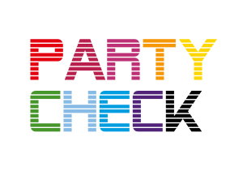

Shield: 

This work is licensed under a [Creative Commons Attribution-NonCommercial 4.0 International License](https://creativecommons.org/licenses/by-nc/4.0/).

# Das Projekt Party Check

Party Check ist ein politikwissenschaftliches Projekt, das kurz vor größeren Wahlen in Deutschland die Stimmung der Bevölkerung zu relevanten politischen Fragen erfasst. Es ist eine Online-Wahlhilfe, die in der englischsprachigen Forschung auch als "Voting Advice Applications" (VAAs) bekannt sind. Das Tool zur Bundestagswahl 2025 inkl. Fragebogen ist unter [party-check.org](https://party-check.org) erreichbar. Zusätzlich werden Wahlpräferenzen und soziodemographische Faktoren abgefragt. Eine detaillierte Beschreibung der Befragung zur Bundestagswahl 2025 [findet sich auf der Seite der Uni Potsdam]([#0](https://www.uni-potsdam.de/de/vergleichende-politikwissenschaft/team/dr-jan-philipp-thomeczek/party-check)). Betreut wird das Projekt von Sören Müller-Hansen (Süddeutsche Zeitung) und Philipp Thomeczek (Universität Potsdam), zu den jeweiligen Wahlen sind teils weitere Kolleg:innen beteiligt. Der Party-Check soll im nächsten Jahr auch zu den Landtagswahlen angeboten werden. In diesem Repository wird beispielhafter Code zur Verfügung gestellt, um auf Basis der Daten aus Party Check eigene Analysen durchzuführen. Die Daten und der hier zur Verfügung gestellte Code können unter Berücksichtigung der folgenden Open-Source-Lizenz frei verwendet werden.

-   Nutzungsrecht: [CC BY-NC 4.0](https://creativecommons.org/licenses/by-nc/4.0/)

## Was ist Party Check?

Party Check ist eine Online-Wahlhilfe (engl. Voting Advice Application), mit der Nutzer:innen die Übereinstimmung ihrer eigenen Meinung mit Parteien herausfinden können. Im Unterschied zum Wahl-O-Mat positionieren sich die Parteien nicht selbst, sondern werden von Expert:innen aus der Forschung eingeordnet. Datensätze zu den Parteipositionen bei der Europawahl 2024 und den Landtagswahlen in Sachsen, Sachsen-Anhalt und Thüringen 2024 und in Hamburg 2025 [finden sich im Harvard Dataverse](https://dataverse.harvard.edu/dataverse/harvard?q=thomeczek&fq1=authorName_ss%3A%22Thomeczek%2C+J.+Philipp%22&fq0=dvObjectType%3A%28dataverses+OR+datasets+OR+files%29&types=dataverses%3Adatasets%3Afiles&sort=score&order=). Die Daten und zugehörige Analysen der Parteipositionen der Open Expert Survey zur Bundestagswahl 2025 ist unter [oes25.de](https://oes25.de/) zu finden. Ein weiterer Unterschied zum Wahl-O-Mat ist, dass User:innen freiwillige Zusatzangaben machen können, die dann mit ihren Positionen gespeichert werden. Durch die Abfrage soziodemografischer Daten entsteht so ein detaillierter Datensatz, der auch Analysen zu Subgruppen ermöglicht.

In aufgeheizten Wahlkämpfen wird in den Medien oft pauschal von „der Meinung der Bevölkerung“ gesprochen – eine Vereinfachung, die den tatsächlichen politischen Einstellungen kaum gerecht wird. Party Check ermöglicht es Datenjournalist:innen, differenzierte und evidenzbasierte Analysen zu erstellen, die das Meinungsspektrum realitätsnäher abbilden

Party Check wurde bereits erfolgreich bei der Europawahl 2024 (60 000 User:innen) und der Bundestagswahl 2025 (50 000 User:innen) eingesetzt. Er bietet User:innen eine Orientierung bei der Wahl und schafft einen hochwertigen Datensatz, der sowohl für die politikwissenschaftliche Forschung genutzt wird als auch zeitnah schon kurz vor der Wahl für datenjournalistische Projekte zur Verfügung steht. Unten ist eine angenommene Version eines Papers verlinkt, was in die Daten einführt und in Kürze bei "European Union Politics" erscheint.

## Repräsentativität der Daten

Party Check ist keine repräsentative Befragung. Ebenso ist es keine Zufallsstichprobe: Alle, die einen Link zum Tool haben, können und sollen es natürlich nutzen. Die User:innen nutzen das Tool freiwillig, auch die Angabe soziodemographischer Daten ist freiwillig. Das muss bei der Nutzung des Datensatzes beachtet werden. Traditionell sind beispielsweise Höhergebildete, Politikinteressierte und Wähler:innen überrepräsentiert. Sicherlich sind die Daten nicht für "Horse Race" Prognosen á la "Wie viele Stimmen erhält Partei X bei der nächsten Wahl?" geeignet. Ein Vergleich mit Daten aus repräsentativen Stichproben zeigt aber, dass VAA-Daten zu sehr ähnlichen Rückschlüssen kommen (z.B. Was sind die Themen, die Wähler:innen zu bestimmten Parteien treiben?), vor allem, wenn man sie gewichtet [(siehe z.B. dieses Paper)](linkinghub.elsevier.com/retrieve/pii/S0261379421001190). Im bereitgestellten Code finden sich auch Scripte zur Gewichtung und wie auf Basis der Gewichte eine quotierte Stichprobe, die der deutschen Bevölkerungsstruktur ähnlicher ist, gezogen werden kann.

## Datenzugang

Langfristig sollen die Befragungsergebnisse vergangener Wahlen im Harvard Dataverse zur Verfügung gestellt werden. Dort sind aktuell die Daten zur Europawahl 2024 bereits verfügbar : <https://doi.org/10.7910/DVN/7PBJS9>. Nehmt für aktuelle Projekte, insbesondere zu anstehenden Wahlen, bitte einfach Kontakt zu Philipp Thomeczek und Sören Müller-Hansen auf.

## Codebook

Um die Daten verstehen zu können, ist eine Übersetzung der Werte mit Hilfe eines Codebooks notwendig. Für die Daten zur Europawahl (Euro Party Check) ist das Codebook im Harvard Dataverse zu finden. Mit der Funktion `download_euro_party_check()` wird das Codebook auch lokal heruntergeladen. Beispielhafter Code findet sich im Skript `example_analysis.R`.

Eine mit KI erstellte maschinenlesbare Version des Codebooks ist in `input/codebook_eu_party_check.csv` zu finden. Vorsicht bei der Verwendung: Die Datei wurde nicht vollständig geprüft und könnte Fehler enthalten.

## Verwendung

Die hier angebotenen Skripte sind in R geschrieben. Um sie auszuführen, müsst ihr eine aktuelle Version von R und R-Studio installiert haben. Anschließend könnt ihr das Repository klonen und in R-Studio öffnen.

1.  Repository in der Konsole klonen `git clone https://github.com/SZ-Datenjournalismus/2025-party-check-public.git`
2.  Die Datei `2025-party-check-public.Rproj` in R-Studio öffnen

### Skripte

-   `config.R`: In diesem Skript werden alle notwendigen Packages installiert und Einstellungen geladen. Das Skript sollte immer zuerst ausgeführt werden.

-   `party_check_functions.R`: Beinhaltet Funktionen, um die Party Check Daten aufzubereiten und zu analysieren.

-   `weight_data.R`: In diesem Skript werden die Rohdaten beispielhaft gewichtet.

-   `calculate_quota_sample.R`: Hier wird eine Stichprobe (n = 2000) aus dem Gesamtdatensatz gezogen, der die Bevölkerungsstruktur nach Alter, Geschlecht, Bildung und Region besser abbildet.

-   `example_analysis.Rmd`: Beispielanalyse von Daten aus Party Check. `config.R` und `party_check_functions.R` werden in diesem Skript bereits geladen.

### Ordnerstruktur

Alle Skripte liegen im Ordner `scripts/`. Rohdaten oder Metadaten, die für die Analyse benötigt werden, können im Ordner `input/` abgelegt werden. Verarbeitete Daten werden unter `output/` abgespeichert. Dateien, die in einem der `/ignore/`-Ordner gespeichert werden, werden nicht von git getrackt.

## Beispielprojekte

Hier sind einige Projekte aufgelistet, in die Daten aus Party Check eingeflossen sind. Viele der in der Süddeutschen Zeitung erschienen Artikel sind nur mit einem Abo lesbar.

-   Einführendes Paper zu den Daten: [Thomeczek, JP, Wurthmann, LC & Stecker C (Forthcoming): Studying Party-Voter Congruence in the European Elections 2024: Introducing a New Dataset on German Voter Positions from the VAA “Europartycheck”. *European Union Politics*](eup_thomeczek_wurthmann_stecker.pdf) (Studie als PDF)

-   [Deutschland rückt nach rechts, Parteipositionen bei der Bundestagswahl 2025](https://www.sueddeutsche.de/projekte/artikel/politik/deutschland-politische-ausrichtung-rechtsruck-analyse-e061293/) (SZ)

-   [Wie die unmöglichen Koalitionspartner zusammenpassen, Parteipositionen bei den Landtagswahlen in Sachsen und Thüringen 2025](https://www.sueddeutsche.de/projekte/artikel/politik/thueringen-sachsen-cdu-bsw-afd-daten-koalition-gemeinsamkeiten-e049444/) (SZ)

-   [Was die AfD stark macht, Wählermeinungen bei der Bundestagswahl 2025](https://www.sueddeutsche.de/projekte/artikel/politik/bundestagswahl-afd-daten-ost-west-e836369/) (SZ)

-   [Warum die Jungen beim Wählen so gespalten sind, Wählermeinungen bei der Bundestagswahl 2025](https://www.sueddeutsche.de/projekte/artikel/politik/bundestagswahl-2025-junge-waehler-afd-die-linke-e258960/) (SZ)

-   [Junge Wählerinnen und Wähler vor der Bundestagswahl 2025](https://www.sueddeutsche.de/politik/bundestagswahl-jungwaehler-jugend-afd-li.3175931) (SZ)

## Ausblick

2026 finden voraussichtlich fünf Landtagswahlen statt (Baden-Württemberg, Rheinland-Pfalz, Sachsen-Anhalt, Berlin, Mecklenburg-Vorpommern), 2027 auch (Saarland, Bremen, Schleswig-Holstein, Nordrhein-Westfalen, Niedersachsen). Unser Ziel ist es, für jede dieser Wahlen Party Check aufzusetzen: Positionen der Parteien zu relevanten Fragestellungen von Expert:innen bestimmen lassen, die Online-Wahlhilfe Party Check anbieten und User:innen die Möglichkeit geben, ihre Übereinstimmung mit den Parteien zu ermitteln und dabei freiwillige Daten für die Wissenschaft und den Datenjournalismus zu erheben.

Ihr könnt euch gerne einbringen, nehmt dazu einfach Kontakt zu uns auf. Ihr könnt:

-   Im Vorfeld der Wahlen eure Expertise einbringen, welche Fragestellungen für bestimmte Bundesländer besonders relevant sind und auch selbst Fragen für den Zusatzfragebogen vorschlagen.

-   Bei der Verbreitung des Tools helfen. Je mehr Menschen es nutzen, desto umfangreicher sind auch die gewonnenen Daten.

-   Rund um die Wahl mit den Rohdaten arbeiten und eigene Analysen machen. So könnt ihr zu einer qualitativ hochwertigen Berichterstattung jenseits der Fokussierung auf reine Zustimmungswerte bei der Sonntagsfrage beitragen.
